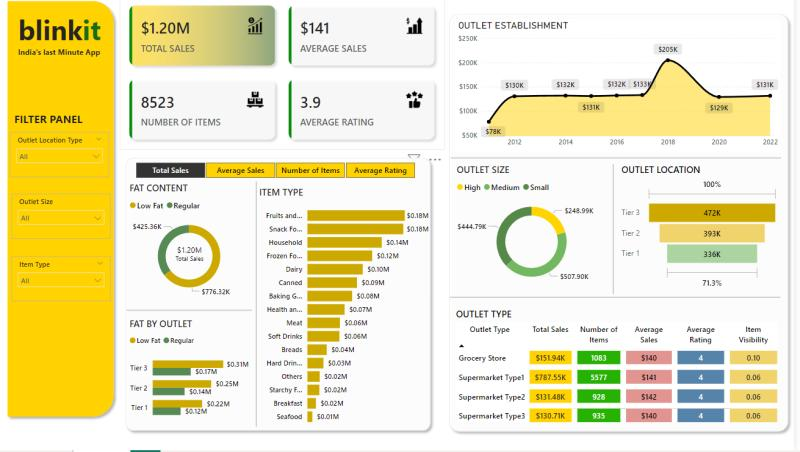

# Blinkit Grocery Sales Analysis — Power BI Dashboard

> An interactive Power BI dashboard analysing **$1.20M in grocery sales across 8,523 items**, breaking down performance by outlet type, size, location tier, item category and fat content — to support merchandising, inventory and outlet-strategy decisions.




### 📥 Download
[**Power BI report (.pbix)**](blinkit.pbix) — open in Power BI Desktop to explore the dashboard interactively.

---

## 📖 Overview

Blinkit is a quick-commerce grocery business, and this dashboard turns its raw sales data into a single interactive view of **what sells, where, and how well it's rated**. It answers the questions a category or operations manager actually asks: which outlet formats drive the most revenue, whether product-mix or store-mix is the lever, and where ratings and visibility need attention.

Built as a single-page Power BI report with a **filter panel** (Outlet Location Type, Outlet Size, Item Type) and **metric-switch tabs** (Total Sales, Average Sales, Number of Items, Average Rating) so one canvas answers many questions.

---

## 🎯 Business Problem

- 🛒 **No consolidated view** of sales across outlet types, sizes and location tiers.
- 📦 **Product-mix blind spots** — which item categories and fat-content types actually drive revenue?
- ⭐ **Quality vs. volume** — are high-selling outlets also well-rated?
- 🏬 **Outlet strategy** — should expansion favour a particular format, size or tier?

---

## 📊 Dashboard Highlights (KPIs)

| Metric | Value |
|---|---|
| **Total Sales** | **$1.20M** |
| **Average Sales / item** | **$141** |
| **Number of Items** | **8,523** |
| **Average Rating** | **3.9** |

**Interactive controls:** filter panel (Location Type · Outlet Size · Item Type) + metric switcher (Total Sales · Average Sales · Number of Items · Average Rating).

---

## 💡 Key Insights

- **Supermarket Type 1 dominates** — ~**$787.55K** of the $1.20M total (roughly two-thirds of all sales) from 5,577 items, making it the core revenue format.
- **Small & medium outlets out-sell large ones** — Small ($507.90K) and Medium ($444.79K) outlets together far outweigh High/large outlets ($248.99K), suggesting reach beats footprint.
- **Tier 3 locations lead** — Tier 3 outlets generated the most sales (472K), ahead of Tier 2 (393K) and Tier 1 (336K).
- **Regular beats Low-Fat** — Regular fat-content products ($776.32K) outsold Low-Fat ($425.36K) by ~1.8×.
- **Fruits & Vegetables and Snack Foods are the top categories** (~$0.18M each), anchoring the product mix.
- **Ratings are consistent (~4)** across every outlet type — quality doesn't vary by format, so volume, not satisfaction, is the differentiator.
- **Establishment trend peaked around 2018** (~$205K) before normalising, useful context for outlet-age vs. performance.

---

## 🛠️ Tech Stack

- **Power BI Desktop** — report design & interactivity
- **DAX** — measures for Total/Average Sales, item counts, rating aggregation, and the metric switch
- **Power Query** — data cleaning & transformation (fat-content standardisation, type handling)
- **Data modelling** — star-schema-style structure over the grocery sales table

---

## 🗂️ Dataset

Public "Blinkit / Grocery Sales" practice dataset. Key fields:

`Item Identifier` · `Item Weight` · `Item Fat Content` · `Item Visibility` · `Item Type` · `Item MRP` · `Outlet Identifier` · `Outlet Establishment Year` · `Outlet Size` · `Outlet Location Type` · `Outlet Type` · `Item Outlet Sales` · `Rating`

> A data-cleaning note: `Item Fat Content` arrives inconsistently (`LF`, `low fat`, `Low Fat`, `reg`, `Regular`) and is standardised in Power Query before analysis.

---

## ▶️ How to Use

1. Open `blinkit_analysis.pbix` in **Power BI Desktop**.
2. Use the **filter panel** on the left to slice by location type, outlet size or item type.
3. Use the **metric tabs** to switch the visuals between Total Sales, Average Sales, Number of Items and Average Rating.

---

## 🧰 Skills Demonstrated

`Power BI` · `DAX measures` · `Power Query (ETL)` · `Data cleaning & standardisation` · `Data modelling` · `KPI design` · `Interactive dashboard design` · `Retail / sales analytics` · `Data storytelling`

---

## 🗂️ Folder Structure

```
blinkit-grocery-sales-analysis-powerbi/
├── README.md
├── assets/
│   └── blinkit_dashboard.png     # dashboard preview
├── blinkit.pbix         # Power BI report  (add your file)
└── LICENSE
```

---

## 🚀 Future Improvements

- **Drill-through pages** per outlet type for deeper category analysis.
- **Time-intelligence** — if transaction dates are added, trend sales month-over-month.
- **Profitability view** — layer margin on top of sales to find high-revenue / low-margin categories.
- **What-if parameters** — model the sales impact of shifting product mix toward top categories.

---

<p align="center">
  <strong>Abilash K S</strong> · Business & Data Analyst<br>
  <a href="https://portfolio-abilash-ks.vercel.app/">Portfolio</a> ·
  <a href="https://www.linkedin.com/in/abilash-k-s/">LinkedIn</a> ·
  <a href="mailto:abilash.connect@zohomail.in">Email</a>
</p>
